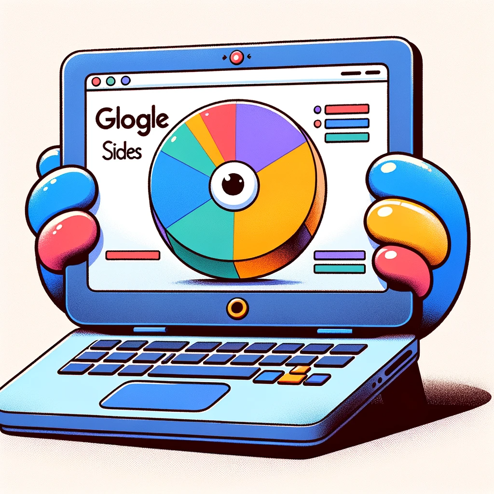

# Slide Deck Prep

To understand your end goal for the opening Slide Deck that you will present, refer to these Demo Day videos:

**Team Happ'n**
[Slide Demo](https://www.youtube.com/watch?v=yUl6RRdJwpQ&t=4978s) - watch from 23:15 to 24:50

**Team Dev Impact**
[Slide Demo](https://www.youtube.com/watch?v=yUl6RRdJwpQ&t=4978s) -
watch from 49:35 to 51:55

Slides must include:

- Team Name (with team member names)
- Problem
- Solution
- Persona
- App Name

You may use any Slide application to create your Slides.

Alternatives to PowerPoint:

- Google Slides
- Keynote
- [Prezi](https://prezi.com/)
- [Slides](https://slides.com/)
- [Canva](https://www.canva.com/)
- [SlidesAI.io](https://workspace.google.com/marketplace/app/slidesaiio_create_slides_with_ai/904276957168)
- Beautiful.ai
- [Tome.ai](https://tome.app/)

[Home](README.md)
